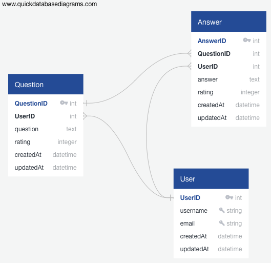

[Horrorflow]() - Asking the important questions about Horror films.
---
*by [Adam Jacobson](https://github.com/djangothesolarboy)*

Table Of Contents:
---
- [Description](https://github.com/djangothesolarboy/horrorflow#Description)
- [Application Architecture && Technologies Used](https://github.com/djangothesolarboy/horrorflow#Application-Architecture-&&-Technologies-Used)
- [Technology Shields](https://github.com/djangothesolarboy/horrorflow#Technology-Shields)
- [Frontend Overview](https://github.com/djangothesolarboy/horrorflow#Frontend-Overview)
- [Backend Overview](https://github.com/djangothesolarboy/horrorflow#Backend-Overview)


Description:
---
Horrorflow is a clone of Stack Overflow, but with a twist, like most good horror films! Horrorflow is meant to be a place where horror film lovers can go to ask the tough questions. It is an idea that I am sure many film watchers have wondered. Have you ever watched a horror film and wondered *'What the heck was that ending?!*? Well Horrorflow aims to be your one-stop-shop to ask the **Who What When Why**, instead of scouring the internet endlessly for answers!

Application Architecture && Technologies Used:
---
Horrorflow was built using the Express NodeJS framework with a PostgreSQL(postgres) database to store all the application data in combination.

The front ends uses React && Redux in order to render pages. Vanilla Javascript and standard CSS were also used for styling as well. 


Frontend Overview:
---
This application does rely a lot on the backend and the database. The frontend uses vanilla Javascript, some HTML, standard CSS along with React && Redux. The goal is to use as little premade things as possible and doing things myself. Csurf along with JWT was used for authentication.

Example of Login Validation:
```js
const validateLogin = [
    check('credential')
        .exists({ checkFalsy: true })
        .notEmpty()
        .withMessage('Please provide a valid email or username.'),
    check('password')
        .exists({ checkFalsy: true })
        .withMessage('Please provide a password.'),
    handleValidationErrors,
];
```
[](https://gyazo.com/80d8ad1dec38562aa15c8d5b5f67b798)

Snippet of code from Signup Validation:
```js
const validateSignup = [
    check('email')
        .exists({ checkFalsy: true })
        .isEmail()
        .withMessage('Please provide a valid email.'),
    check('username')
        .exists({ checkFalsy: true })
        .isLength({ min: 4 })
        .withMessage('Please provide a username with at least 4 characters.'),
    check('username')
        .not()
        .isEmail()
        .withMessage('Username cannot be an email.'),
    check('password')
        .exists({ checkFalsy: true })
        .isLength({ min: 6 })
        .withMessage('Password must be 6 characters or more.'),
    handleValidationErrors,
];
```

[](https://gyazo.com/b5663c8570bf4f702728901731983a88)


Backend Overview:
---
This application isn't super heavy on the backend with database management. But it does need the tables within the database to relate properly in order for the features to all work porperly.

Database:
---
The database for Horrorflow really only has a few tables, but each is very important in relating to one another. I tried to design the database as easily as I could and feel what I came up with should work well. 

Here is a diagram of the database implemented for Horrorflow:



Technology Shields:
---
 
 
 

  

  
 
 
 
 